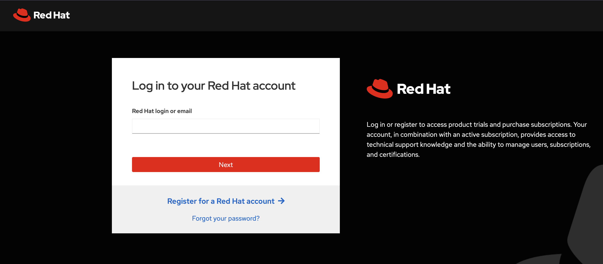
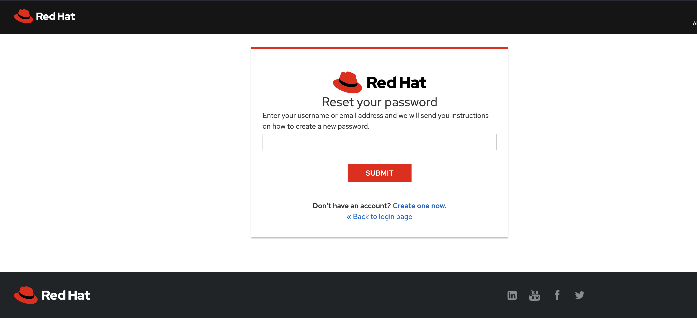
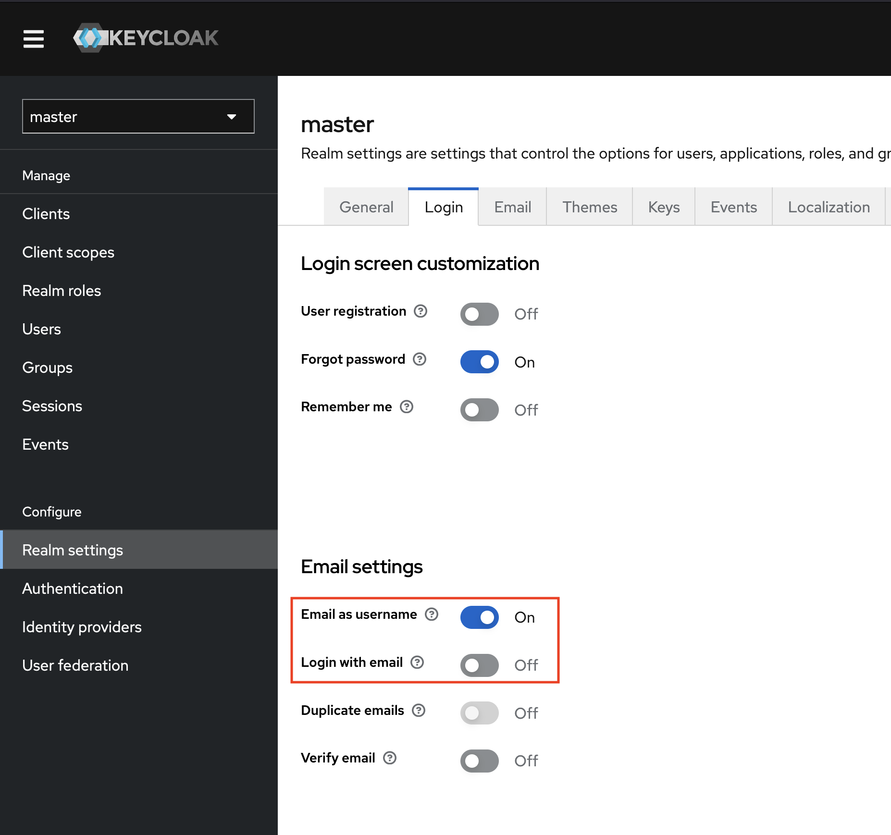

# CVE-2021-3754
This repository documents Vulnerability details and exploit for CVE-2021-3754 discovered and reported by myself on 21st August 2021

## Metrics
- [CWE-20: Improper Input Validation](https://cwe.mitre.org/data/definitions/20.html)
- [CVSS: 5.3 (MEDIUM)](https://nvd.nist.gov/vuln-metrics/cvss/v3-calculator?name=CVE-2021-3754&vector=AV:N/AC:L/PR:N/UI:N/S:U/C:N/I:N/A:L&version=3.1&source=NIST)

## Description
A flaw was found in Apache Keycloak & Redhat SSO where an attacker is able to register himself with the username same as the email ID of any existing user.  
This is caused by usernames being evaluated before emails.
Keycloak allows the use of email as a username and doesn't check that an account with this email already exists.  

## Impact
The above behaviour will cause trouble getting a password recovery email if the user forgets the password, thereby locking users out of their own account temporarily.  

## Mitigation (as suggested by Redhat. Has not been verified/tested by myself)
The workaround is to enable "Email as username" flag or disable "Login with email" in the login settings.  

## Proof of Concept/Exploit
Following is a proof of concept video which I initially reported to Redhat, which demonstrates the complete vulnerability along with exploitation steps [CLICK THE THUMBNAIL]:    

  

## Notes
- Please note that the suggested by Redhat is temporary and the root issue of improper input validation has not been fixed by Redhat/Keycloak.
- Note that the mitigation suggested above by Redhat for keycloak has not been tested and verified by myself.
- Note that if you are using keycloak/Redhat SSO in any of your products/applications, you are still vulnerable. I have verified that Redhat SSO is still vulnerable to this issue.
- If you are using keycloak and you have not configured the login screen settings properly, you might still be vulnerable.

## Important Links
- https://nvd.nist.gov/vuln/detail/CVE-2021-3754
- https://www.cvedetails.com/cve/CVE-2021-3754/
- https://bugzilla.redhat.com/show_bug.cgi?id=1999196
- https://access.redhat.com/security/cve/CVE-2021-3754
- https://github.com/advisories/GHSA-j9xq-j329-2xvg
- https://vulners.com/cve/CVE-2021-3754
- https://www.tenable.com/cve/CVE-2021-3754

